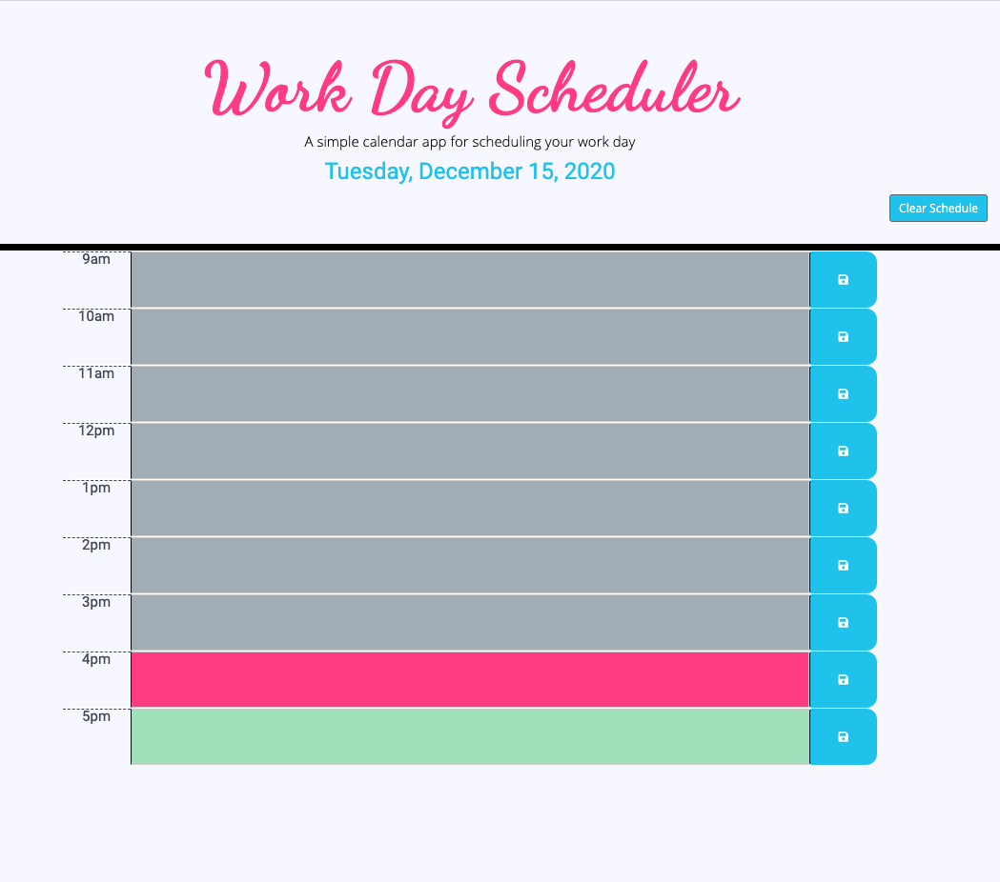

# Day-Scheduler

Create a day scheduler that load-retrieves to-do's from local storage and colorizes past, present, future time slots.

## CRITERIA MET

- day.js was used to access current date and time for scheduler functionality

- On page load presents

  - A day scheduler with the current day's date displayed at top
  - And time blocks of regular business day hours

- Each time block is color-coded to indicate if the appt. time has passed, is current, or is in the future.

- User can click on timeblock textarea to enter a "todo" or appointment.

- When save button next to textarea is clicked, entry is saved to local storage.

- On page refresh, saved events persist

- Button is provided to clear local storage and saved events.

## SCREENSHOT

